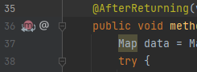
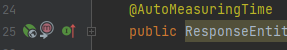

# jfs-operations

jfs-operations is the backend application which consists of the three layers:

* model (domain entities and repositories),
* service (business logic implementation),
* controller (REST API)

and utility packages such as:

* config (Spring Boot configuration),
* infrastructure (AOP aspects, exception handlers and API versioning mechanism).

## Application start

To run the application use the `mvn spring-boot:run`.

## Local DB connection settings

To configure the local DB, `spring.datasource.url`, `spring.datasource.username` and `spring.datasource.password`
should be set in the `src/main/resources/application-dev.properties`.

## Profiles

There are following application profiles:

* `dev` - for development purposes - without docker configuration (active by default),
* `docker` - for development purposes - with docker configuration,
* `ci` - CI/CD server configuration - should not be used locally,
* `prod` - for production purposes - should not be used locally.

To enforce profile with maven the `-P<profile_name>` switch should be added to run command.

## Technical specification - quick overview

### Docker&Kubernetes
The jfs-operations docker image could be run with `docker-compose up --build`. The docker configuration consist of the 
Spring Boot app image and postgresql.

### API versioning
REST API could be versioned with the `@ApiVersion` annotation, which is the class and method level annotation. 
The `@ApiVersion` could store one or several versions - both `@ApiVersion(4)` and `@ApiVersion({1, 2, 3})` are valid.
The version is set in the request URL as the prefix, and the version number i.e.: `/v1/api/test` 
where the `v` comes from the `application.properties` (`app.api.prefix`) and the number from the `@ApiVersion` annotation. 

### Aspects
### Aspects definition
Aspects definition consists of:

* join point (Pointcut definition) - `*.ascpect.joinpoint` package,  `*JoinPoint` suffixed class,
* aspect logic definition - `*.ascpect` package,  `*Aspect` suffixed class. 

The Pointcut is set as the method f.eg.:

```java
// *.ascpect.joinpoint package

@Aspect
@Component
public class SomeJoinPoint {
  @Pointcut("@annotation(annotation.aspect.infrastructure.com.javafee.elibrary.micro.AutoLoggable)")
  private void execAll() {
  }

  @Pointcut("execAll()")
  public void execPointcut() {
  }
}
```

and then is used in the Aspect method:

```java
// *.ascpect package

@Aspect
@Component
public class SomeAspect {
  @AfterReturning(value = "com.jfs.operations.infrastructure.aspect.joinpoint.SomeJoinPoint.execPointcut()", returning = "result")
  public void methodInvoked(JoinPoint joinPoint, Object result) {
  }
}
```

On the Aspect level class - in the IntelliJ IDEA - there's the possibility to see all the advised pointcuts by clicking the 
following icon:



and from the method perspective it's possible - in the IntelliJ IDEA - to identify that the aspect is 'listening' on it:



### Application aspects overview
Aspects implemented in the app provide following functionalities:

* `@AutoLoggable` annotation - the method level annotation allows input/output logging as per the expression: 
`Data: {0} at {1}.{2}` where `{0}` is the JSON representation of:
  * `result` node: (join point - method) returning value,
  * `parameters` node: (join point - method) input arguments,
  
  and `{1}.{2}` is the method name. `@AutoLoggable` is used in the `AutoLoggableAspect` as the join point defined in
  `joinpoint.aspect.infrastructure.com.javafee.elibrary.micro.AutoLoggableJoinPoint.execPointcut`. The join point is used in
  AfterReturning and AfterThrowing type aspects implementation - `aspect.infrastructure.com.javafee.elibrary.micro.AutoLoggableAspect`. 
  Example:
  `Data: {"result":[{"id":1,"name":null,"text":null},{"id":2,"name":null,"text":null}],"parameters":[]} at impl.service.com.javafee.elibrary.micro.TestServiceImpl.getAll`


* `@AutoMeasuringTime` annotation - the method level annotation allows method execution time measuring as per the expression:
  `Measuring time: {0} [ms] at {1}.{2}` where `{0}` is the measured time value, and `{1}.{2}` is the method name. 
  `@AutoMeasuringTime` is used in the `AutoMeasuringTimeAspect` as the join point defined in
  `joinpoint.aspect.infrastructure.com.javafee.elibrary.micro.AutoMeasuringTimeJoinPoint.execPointcut`. The join point is used in
  Around type aspect implementation - `aspect.infrastructure.com.javafee.elibrary.micro.AutoMeasuringTimeAspect`.
  Example:
  `Measuring time: 95 [ms] at impl.api.controller.com.javafee.elibrary.micro.TestController.findAll`
  
### Logging
Logging is configured in the `src/main/resources/logback-spring.xml` file as following:

* There're three appenders defined:
  * Console: `<appender name="STDOUT" class="ch.qos.logback.core.ConsoleAppender">` - for general purposes, set to INFO level, 
    of the following pattern: `%d{HH:mm:ss.SSS}, "trace": "%X{X-B3-TraceId:-}", [%thread] %-5level %logger{36} - %msg%n`,
  * 'General' file: `<appender name="FILE" class="ch.qos.logback.core.FileAppender">` - for general purposes, set to DEBUG level, 
    of the following pattern: `%date %level [%thread] %logger{10} [%file:%line] %msg%n`, once the server is started 
    the new file with current timestamp and `jfs-operations-` prefix is created,
  * 'Time' file: `<appender name="STDOUT" class="ch.qos.logback.core.ConsoleAppender">` - for REST method diagnosing purposes, 
    set to INFO level, of the following pattern: `%date %level [%thread] "trace": [%X{X-B3-TraceId:-}] %msg%n`, once the server 
    is started the new file with current timestamp and `time-` prefix is created.
* Logs are handled on the code level with the lombok `@Slf4j` annotation by appropriate method invocation:
    ```java 
    log.info("Some message")
    log.debug("Some message")
    log.error("Some message", e) // where e is the Throwable type object
    ```
* Logs are located in the jfs-operations-logs directory in the main project level.

### Actuator

### Auditing (TODO)

